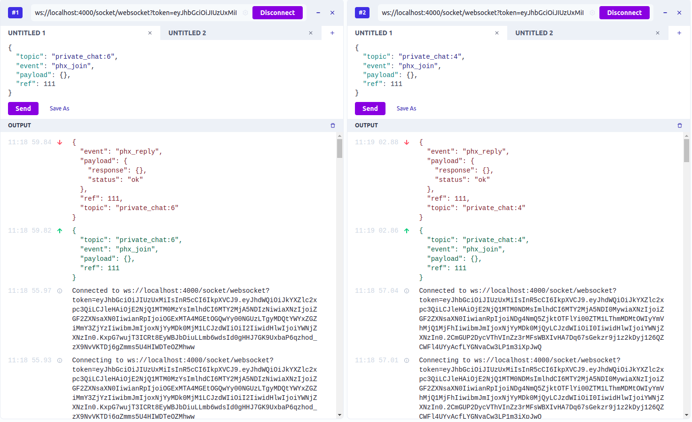
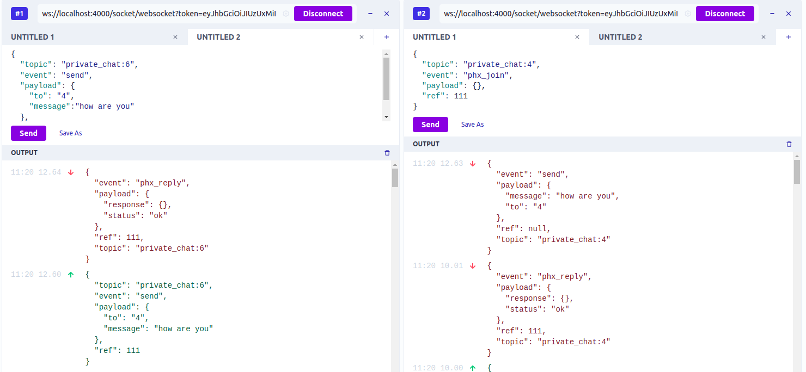

## Brief

After a few awkward experiences trying to sell your car on Craigslist, including that time you received a strange offer from a complete stranger which was totally unrelated to your old Toyota Camry, you decide to that there has to be a better way. So, you build it: *Daveslist - for used cars.*

Now it's time to build the API. In the application, users should be able to interact with each other by creating listings, replying to listings, and sending private messages. Users should also have different permissions within the app depending on their status (e.g. anonymous site visitor, registered user, moderator, and admin.) 

## Prerequisites
- Language: *Elixir*
- Framework: *Phoenix*
- Database: *Postgres*

## Local Setup
To start your Phoenix server:

  * Install dependencies with `mix deps.get`
  * Create and migrate your database with `mix ecto.setup`
  * Start Phoenix endpoint with `mix phx.server` or inside IEx with `iex -S mix phx.server`

Now you can visit [`localhost:4000`](http://localhost:4000) from your browser.

Ready to run in production? Please [check our deployment guides](https://hexdocs.pm/phoenix/deployment.html).

## Private Chat - WebSockets
## 1. Sockets Implementation
A phoenix socket can be joined using the endpoint:

    wss://HOSTNAME/socket/websocket?token=jwt-token.will-goes.here
    ws://localhost:4000/socket/websocket?token=jwt-token.will-goes.here

_**PS:** Where the token is the **JWT token** used in the current authentication._

**To test our web sockets connection, we can utilize the Chrome [Socket Extension](https://chrome.google.com/webstore/detail/websocket-king-client/cbcbkhdmedgianpaifchdaddpnmgnknn?hl=en).**
_After connecting with sockets we are required to join the channel with a topic._

## 2. Join channel
A channel can be joined by sending the below payload on socket connection.
```json5
{
  "topic": "private_chat:{user_id}",
  "event": "phx_join",
  "payload": {},
  "ref": 111
}
```
- **Topic** is related to the channel
- **Event** the function we are performing on that topic
- **Payload** is what we are sending on to the event.
- **Ref** is the sequence number of the response with **phx_reply** event.

_The **response** after joining the topic will be as follows_
```json5
{
  "event": "phx_reply",
  "payload": {
    "response": {},
    "status": "ok"
  },
  "ref": 111,
  "topic": "private_chat:{user_id here}"
}
```

**Topic.**
`private_chat:user_id_here`
In this topic we explicitly pass a user_id to join the user's own channel. We created that specific topic to check that the user of this specific id exists or not and he/she should be a registered user of the app.

## ➤ 2. Send Chat
Send this following response from the socket to start the chat in the channel on the same joined topic.
```json5
{
  "topic": "private_chat:{user_id}",
  "event": "send",
  "payload": {
    "to": "{user_id}",
    "message":"Hey How are you"
  },
  "ref": 111
}
```


Whenever a user triggers and event **"send"** , a **broadcasted** response will be sent on the topic `private_chat:{user_id_here}` to the other user whom user_id we are passing in payload **we must require to join that channel to get that broadcasted** response. Whenever a user joins a private_chat, user is automatically subscribed with the channel and all of the incoming and outgoing user's response will be broadcasted in that channel.

**Broadcasted Message:**
```json5
{
  "event": "send",
  "payload": {
    "message": "how are you",
    "to": "{user_id_here}"
  },
  "ref": null,
  "topic": "private_chat:{user_id_here}"
}
```

In this way the users can send private messages to each other by passing the user_id in the payload and the Chat will be saved in the DB table as well. 

## Sample Private Chat

#### Joining Socket & Private Chat Channel

#### User 1 is sending Message to User2

#### User 2 is replying back to User 1

## Learn more

  * Official website: https://www.phoenixframework.org/
  * Guides: https://hexdocs.pm/phoenix/overview.html
  * Docs: https://hexdocs.pm/phoenix
  * Forum: https://elixirforum.com/c/phoenix-forum
  * Source: https://github.com/phoenixframework/phoenix
